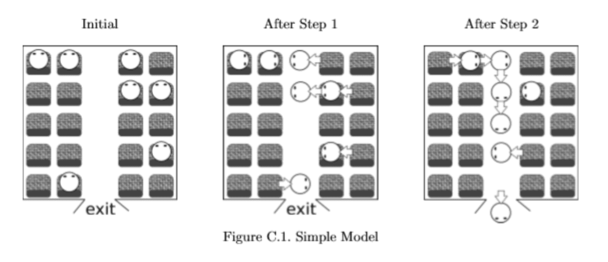

# 2020 牛客国庆集训派对 Day4

???+ info "Contents"
    [TOC]

## Contest Info

[Practice Link](https://ac.nowcoder.com/acm/contest/7831)

| Solved |   A   |   B   |   C   |   D   |   E   |   F   |   G   |   H   |   I   |   J   |
| :----: | :---: | :---: | :---: | :---: | :---: | :---: | :---: | :---: | :---: | :---: |
|  7/10  |   O   |   O   |   O   |   Ø   |   -   |   Ø   |   -   |   O   |   -   |   O   |

* O    在比赛中通过
* Ø    赛后通过
* !    尝试了但是失败了
* \-   没有尝试

## Solutions

### Problem A. Digits Are Not Just Characters

Solved By Dup4. 00:38(+)

#### 题意

给出两个字符串，按特定规则比较大小。

规则就是一个字符串中，单个字符视为 `letter item`，连续的数字视为 `digit item`。

* `digit item` 排在 `letter item` 前面。
* `letter item` 之间按照字典序排序。
* `digit item` 按照实际的值排序。

#### 思路

* 暴力模拟即可。
* 但是我的代码也太长了。
* 学习了一段代码，发现直接处理后，用 `vector` 去比较就行了，对于字符的处理要将它处理成一个较大的数字。
* 然后发现题意中对于「排序」的定义，其实就是 `PHP` 中的 `strnatcmp`。

??? info "Code"
    ```cpp
    ---8<--
    2020/nowcoder-national-day-training-party/day4/solutions/a.cpp
    ---8<--
    ```

??? info "Code"
    ```cpp
    ---8<--
    2020/nowcoder-national-day-training-party/day4/solutions/a1.cpp
    ---8<--
    ```

??? info "Code"
    ```php
    ---8<--
    2020/nowcoder-national-day-training-party/day4/solutions/a2.php
    ---8<--
    ```

### Problem B. Arithmetic Progressions

Solved By Dup4. 00:45(+)

#### 题意

给出 $n$ 个数 $a_i$，找一个子序列，使得这个子序列排序后是一个「等差数列」。

#### 思路

* 先排序。
* $f_{i, j}$ 表示等差数列的最后一项为 $a_j$, 倒数第二项为 $a_i$ 的最大长度是多少。
* 因为倒数两个数确定了，差就确定了，然后枚举 $i, j$ 找前驱的一个 $k$ 进行转移即可。

??? info "Code"
    ```cpp
    ---8<--
    2020/nowcoder-national-day-training-party/day4/solutions/b.cpp
    ---8<--
    ```

### Problem C. Emergency Evacuation

Solved By groggy\_. 01:40(+)

#### 题意

有一辆公交车，有 $n$ 行，$m$ 列，并且两边是对称的。

{ width="480" }

每个位置上的人移动一个单位需要一个单位的时间，问所有人到达出口需要多少时间？

#### 思路

* 因为正着做会发生阻塞，我们将这个过程反过来，即刚开始大家都等在出口，然后需要到达自己的位置。
* 我们让路程时间最长的先走，因为路程时间长的不会阻塞路程时间短的。

??? info "Code"
    ```cpp
    ---8<--
    2020/nowcoder-national-day-training-party/day4/solutions/c.cpp
    ---8<--
    ```

### Problem D. Shortest Common Non-Subsequence

Upsolved By Dup4.

#### 题意

给出两个 `01` 串 $s$ 和 $t$，现在要构造一个最短的 `01` 串，使得这个 `01` 串既不是 $s$ 的子序列也不是 $t$ 的子序列。
要求输出长度最小、其次字典序最小的答案。

#### 思路

* 假设答案为 $n$ 位，那么答案的前 $n - 1$ 位构成的 `01` 串肯定是 $s$ 和子序列或者是 $t$ 的子序列。
* 那么我们倒着 `dp`，$f_{i, j}$ 表示 $s$ 串的后 $i$ 位，$t$ 串的后 $j$ 位失配的最短长度。
* 要求字典序最小，我们正着贪心即可。优先放 $0$。

??? info "Code"
    ```cpp
    ---8<--
    2020/nowcoder-national-day-training-party/day4/solutions/d.cpp
    ---8<--
    ```

### Problem E. Fair Chocolate-Cutting

Upsolved By -.

#### 题意

#### 思路

### Problem F. What Goes Up Must Come Down

Upsolved By Dup4.

#### 题意

给出 $n$ 个数 $a_i$，现在每次只能交换相邻两个数，问将这个数列调整成只有一个山峰的形状最少需要多少次？

#### 思路

* 对于一个数来说，最终要么是它左边的数全都小于等于它，要么是它右边的数全都小于等于它。
* 那么就是它左边比它大的数全都要跨过它到右边，或者右边比它大的数全都要跨过它到左边，我们取 `Min` 即可。

### Problem G. Ranks

Upsolved By -.

#### 题意

#### 思路

### Problem H. Colorful Tree

Solved By Dup4. 04:57(+10)

#### 题意

给出一棵树，每个点有一个初始颜色 $c_i$，有两种操作：

* `U x y`，将点 $u$ 的颜色改成 $y$。
* `Q y`, 询问所有颜色为 $y$ 的点组成的虚数的周长。

#### 思路

用 `set` 维护每种颜色虚树周长即可。

??? info "Code"
    ```cpp
    ---8<--
    2020/nowcoder-national-day-training-party/day4/solutions/h.cpp
    ---8<--
    ```

### Problem I. Sixth Sense

Upsolved By -.

#### 题意

#### 思路

### Problem J. Jokewithpermutation

Solved By Dup4 & groggy\_. 01:14(+)

#### 题意

给出一个字符串，这个字符串是一个全排列中每个数字连接起来的。

现在要求将数字分开，还原成全排列序列。

#### 思路

可以根据长度得到 $n$，然后暴力搜索就行了。

??? info "Code"
    ```cpp
    ---8<--
    2020/nowcoder-national-day-training-party/day4/solutions/j.cpp
    ---8<--
    ```
