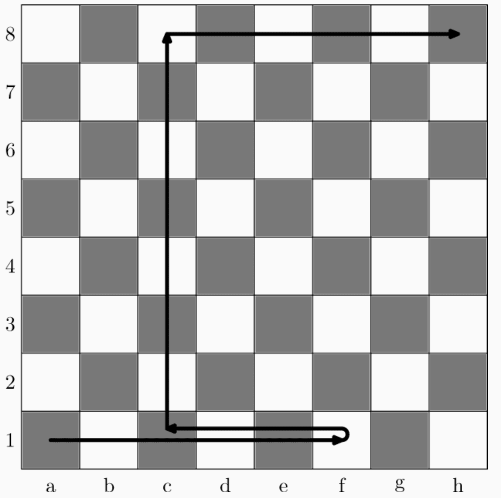

# 2020 牛客国庆集训派对 Day8

???+ info "Contents"
    [TOC]

## Contest Info

[Practice Link](https://ac.nowcoder.com/acm/contest/7865)

| Solved |   A   |   B   |   C   |   D   |   E   |   F   |   G   |   H   |   I   |   J   |   K   |
| :----: | :---: | :---: | :---: | :---: | :---: | :---: | :---: | :---: | :---: | :---: | :---: |
|  6/11  |   O   |   -   |   -   |   O   |   O   |   O   |   O   |   -   |   -   |   O   |   -   |

* O    在比赛中通过
* Ø    赛后通过
* !    尝试了但是失败了
* \-   没有尝试

## Solutions

### Problem A. Easy Chess

Solved By Dup4. 02:36(+2)

#### 题意

给出一个 $8 \cdot 8$ 的棋盘，要求给出 $a_1$ 到 $h_8$ 的长度为 $n$ 的路径。

{ width="480" }

#### 思路

分类讨论一下，然后绕来绕去。

??? info "Code"
    ```cpp
    ---8<--
    2020/nowcoder-national-day-training-party/day8/solutions/a.cpp
    ---8<--
    ```

### Problem B. Cactus Jubilee

Upsolved By -.

#### 题意

#### 思路

### Problem C. Distance on Triangulation

Upsolved By -.

#### 题意

#### 思路

### Problem D. PACM Team

Solved By Dup4. 01:37(+1)

#### 题意

给出 $n$ 个队伍，每个队伍有四种属性 $p_i, a_i, c_i, m_i$，选取一支队伍能够获得 $g_i$ 点利益。
现在选出若干支队伍，并且要求 $\sum p_i \leq P, \sum a_i \leq A, \sum c_i \leq C, \sum m_i \leq M$, 并且利益最大。

$1 \leq n, p_i, a_i, c_i, m_i, P, A, C, M \leq 36$。

#### 思路

分成两段枚举，每段 $18$ 个，然后拼接。

??? info "Code"
    ```cpp
    ---8<--
    2020/nowcoder-national-day-training-party/day8/solutions/d.cpp
    ---8<--
    ```

### Problem E. Easy Problemset

Solved By Dup4. 00:55(+)

#### 题意

给出一些策略，然后选出若干个题目，求总的 `hardness`。

#### 思路

签到。

??? info "Code"
    ```cpp
    ---8<--
    2020/nowcoder-national-day-training-party/day8/solutions/e.cpp
    ---8<--
    ```

### Problem F. Landscape Improved

Solved By Dup4. 03:21(+)

#### 题意

给出 $n$ 个矩形，宽度为一个单位宽度，高度为 $h_i$，现在能够增加某个矩形的高度，能增加第 $i$ 个矩形的高度至 $x$，当且仅当第 $i - 1$ 个矩形和第 $i + 1$ 个矩形的高度大于等于 $x - 1$。
现在给出 $m$ 个砖块，问最高的矩形最多能增加到多高？

{ width="480" }

#### 思路

* 二分答案。
* 考虑对于当前第 $i$ 个矩形，如果想让它成为最大高度，假设为 $x$，那么第 $i + 1$ 个矩形高度应该大于等于 $x - 1$，第 $i + 2$ 个矩形高度应该大于等于 $x - 2$。
* 对于第 $i + 1$ 个矩形，如果想让它成为最大高度，假设为 $x$，那么要第 $i + 2$ 个矩形高度应该大于等于 $x - 1$，第 $i + 3$ 个矩形高度应该大于等于 $x - 3$。
* 我们发现，最高矩形右移的过程中，右边那部分矩形所需的高度也在递增，可以线性维护。
* 对于左边的矩形，因为是递减的，好像不太好处理，我们将数组反转，它就变成了右边，处理两遍，然后合并计算即可。

??? info "Code"
    ```cpp
    ---8<--
    2020/nowcoder-national-day-training-party/day8/solutions/f.cpp
    ---8<--
    ```

### Problem G. Shuffle Cards

Solved By Dup4. 00:04(+)

#### 题意

给出一个全排列，然后 $m$ 次操作，每次将一段区间的数提取到开头。

#### 思路

其实就是数组的剪切与合并，用传统的 `Treap` 能做，也能 `pb_ds` 搞一搞。

??? info "Code"
    ```cpp
    ---8<--
    2020/nowcoder-national-day-training-party/day8/solutions/g.cpp
    ---8<--
    ```

### Problem H. Damage Assessment

Upsolved By -.

#### 题意

#### 思路

### Problem I. Filter

Upsolved By -.

#### 题意

#### 思路

### Problem J. Diff-prime Pairs

Solved By Dup4. 00:13(+)

#### 题意

给出 $n$, 求有多少对 $(i, j)$ 满足 $1 \leq i, j \leq n$ 并且 $\displaystyle \frac{i}{\gcd(i, j)}$ 与 $\displaystyle \frac{j}{\gcd(i, j)}$ 互质。

#### 思路

答案就是：

$$
\sum\limits_{i = 1}^n \sum\limits_{j = 1}^{\frac{n}{i}} [j \; is \; prime]
$$

??? info "Code"
    ```cpp
    ---8<--
    2020/nowcoder-national-day-training-party/day8/solutions/j.cpp
    ---8<--
    ```

### Problem K. Improvements

Upsolved By -.

#### 题意

#### 思路
